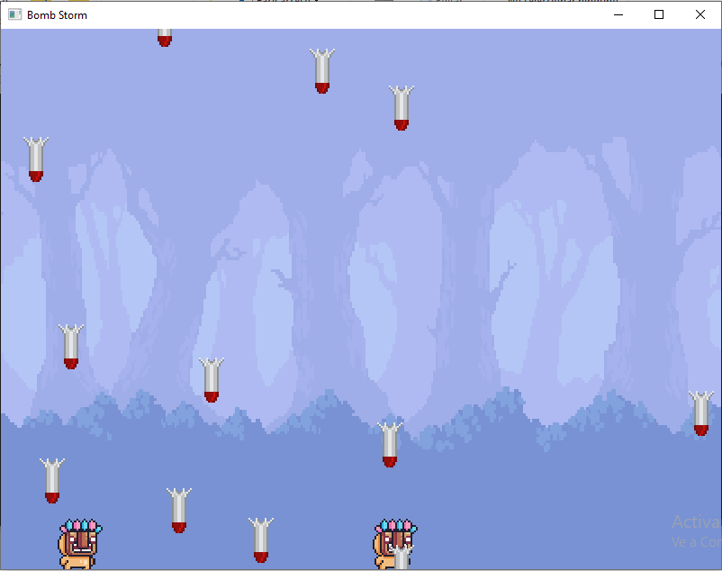
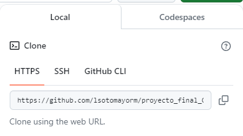
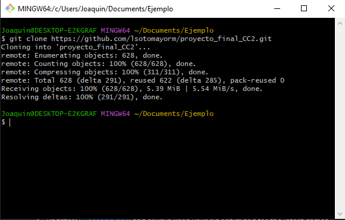

# proyecto_final_CC2
# VideoJuego con SFML: Bomb Storm

Bomb storm es un videojuego de reflejos que nos obliga a sobrevivir a una lluvia de misiles que deberemos evitar para no perder el juego. Esta desarrollado en el lenguaje c++, con el uso de herramientas como Cmake, que se utiliza para definir los procesos de compilación y proporcionar la configuracion para utilizar nuestra biblioteca grafica, y tambien SFML, que es una biblioteca que nos permmite implementar elementos multimedia.

## Integrantes:

- Joaquin Ernesto Polar Espinoza
- Luis Alberto Sotomayor Moya
- Rodrigo Junior Santillana Quispe
- Jesus Alberto Alfaro Buiza
## Imagen del Juego



## ¿De que trata el Juego?
Bomb Storm es un videojuego multijugador local, en donde tendremos que sobrevivir lo más posible a una serie de proyectiles que aparecerán por la parte superior de la pantalla. Contaremos con un vida limitada que se reducirá al ser impactados por cualquier proyectil, si nuestra vida llegara a 0 perderiamos el juego. Por parte del lado multijugador se trata de un juego cooperativo, ya que nuestra vida es compartida y es responsabilidad de ambos jugadores cuidar de esta.

## Problemas en el desarrollo y sus posible soluciones

## Requerimientos para la ejecución del juego

Bomb Storm es un videojuego multijugador local, en donde tendremos que sobrevivir lo más posible a una serie de proyectiles que aparecerán por la parte superior de la pantalla. Contaremos con un vida limitada que se reducirá al ser impactados por cualquier proyectil, si nuestra vida llegara a 0 perderiamos el juego. Por parte del lado multijugador se trata de un juego cooperativo, ya que nuestra vida es compartida y es responsabilidad de ambos jugadores cuidar de esta.
Principalmente necesitaremos descargar Git y CMake. Git nos ayudará a clonar el proyecto, aunque se puede descargar es más seguro clonarlo utilizando esta herramienta, CMake no ayudará a crear nuestro entorno de ejecución, proporcionandonos la librería SFML por medio de una plantilla encontrada en la página de SFML en un repositorio(https://github.com/SFML/cmake-sfml-project) 

### Copiamos la url del repositorio del proyecto



### y lo clonamos usando git clone “url del proyecto”



Luego de esto usaremos los comandos para generar el entorno de ejecución:
### Linux o MacOS

cmake -S . -B build -DCMAKE_BUILD_TYPE=Release
cmake --build build
### Windows

	cmake -S . -B build
   	cmake --build build --config Release
### En caso de linux seria buena idea usar:

	```
    sudo apt update
    sudo apt install \
        libxrandr-dev \
        libxcursor-dev \
        libudev-dev \
        libfreetype-dev \
        libopenal-dev \
        libflac-dev \
        libvorbis-dev \
        libgl1-mesa-dev \
        libegl1-mesa-dev
    ```


 
	
